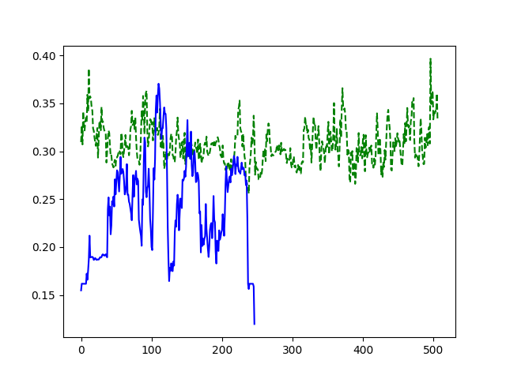

# Kinetics-i3d for Video Features Extraction

This repository is a feature extractor for video data. Each video is considered a collection of instances, with a fixed length and stride between instances. The feature extractor used is [I3D](https://github.com/deepmind/kinetics-i3d) (Two-Stream Inflated 3D ConvNets).

* Save extracted features as numpy array.
* RGB and optical-flow features.
* Optical flow is calculated using OpenCV's implementation of the TVL1 Optical Flow Algorithm.
* Configure instance size, stride, feature extraction layer etc.
* Feature extraction and experiment conducted on [UCF-Crime Dataset](https://www.crcv.ucf.edu/projects/real-world/)

Note: This is not recommended for online feature extraction because the OpenCV-python TVL1 algorithm does not have GPU support and therefore takes a long time to run.


## Requirements

* TensorFlow 1.15.5
* TensorFlow Probability 0.7.0
* NumPy 1.17.2
* OpenCV 3.4.16.59
* Sonnet 1.23
* FFmpeg (ffprobe for finding video duration)
* matplotlib (optional)


## Usage

1. Download the [data](https://github.com/deepmind/kinetics-i3d/tree/master/data) and the [code](https://github.com/deepmind/kinetics-i3d/blob/master/i3d.py) for the I3D model from the official repository of DeepMind's Kinetics-I3D.\
OR\
Clone the [I3D repository](https://github.com/deepmind/kinetics-i3d) and move the files of this repository there.

1. To get the duration of input videos:
    ```
    python duration.py <input-directory> <input-files-list> <output-file-name>
    ```
    Here, the <input-files-list> argument is a file containing the list of input videos, separated by newline. This will create a json file of the format:
    ```
        {
            "video-file": duration(seconds),
            ...
        }
    ```

1. To extract RGB features of videos:
    ```
    python extract_rgb_features.py --input_drn <input-files-duration> --input_dir <input-directory>
      --config <config-file> --output <output-directory> --batch_size <batch-size>
    ```
    Here, the input_drn argument refers to the file in 2. The config file is a JSON file to set the parameters: `height,     width, fps, i3d-feature layer, instance size in seconds, and stride`.

1. To extract optical-flow features of videos:
    ```
    python extract_flow_features.py --input_drn <input-files-duration> --input_dir <input-directory>
      --config <config-file> --output <output-directory> --batch_size <batch-size> --num_threads <num-threads-cpu>
    ```
    Here, the last argument sets the number of threads for running the optical flow algorithm concurrently.
    
1. The first instance of optical flow features has one less frame than the rest, so for the first instance, the placeholder tensor will be of a different size. Hence, the feature extraction for the first instance of the videos is run in a separate script:
    ```
    python extract_flow_features_first.py --input_drn <input-files-duration> --input_dir <input-directory>
      --config <config-file> --output <output-directory> --batch_size <batch-size>    
    ```

1. The scripts can be stopped by keyboard interrupt. Status files `(rgb.txt, flow.txt, flow1st.txt)` keep track of where to resume.

1. To combine, the flow features in 4, 5 run `flow_feature_combine.py`.

## Experiment on Videos with Text-only Frames

To check how I3D features differ between videos in a real-world scenario and videos containing text, plot the mean and variance of the features and compare:
```
python plotMeanVar.py
```
The plots in the [plots_txt](plots_txt) folder show the comparison between the [text-only frames of Normal_Videos381_x264.mp4](https://drive.google.com/drive/u/0/folders/1pWIQCuoPmaDb4ZgWj7FAvyL12OKXKH_v) (blue in the plot) and videos from the abuse category (green in the plot). The difference is very clear for RGB features. But the flow features are related to motion, so in some cases, there is not much of a difference.

